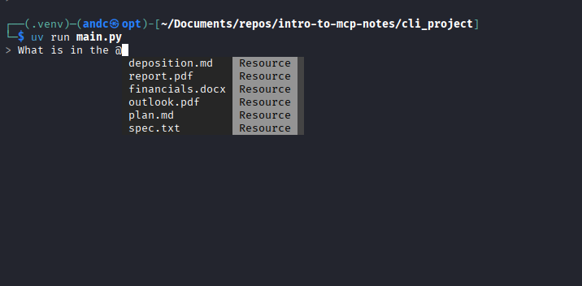

Resources in MCP allow your server to expose information that can be directly included in prompts, rather than requiring tool calls to access data, making for a more efficient way to provide context to AI models.

Resource accessing looks like the following, where, when you type the `@` followed by a resources name, the system will:

- Show all available resources in the autocomplete list
- select resources by using arrow keys
- INclude the resource content directly on our prompt
- Send everything to the AI model without requiering additional tool calls

The implementation of it can be found in [mcp_client.py](../cli_project/mcp_client.py), in our async function called `read_resources`. 

To get a better understading, when we request a resources, the server returns a result with a `contents` list. The function checks the MIME type to determine how to process the content:

- In this case, if its `application/json`, we parse the text as json and return the parsed object.
- Otherwise, we return the raw text content. 

All this combined does for a smoother experience in comparison to having the tool/AI model make separate calls to the tools to access the documents.