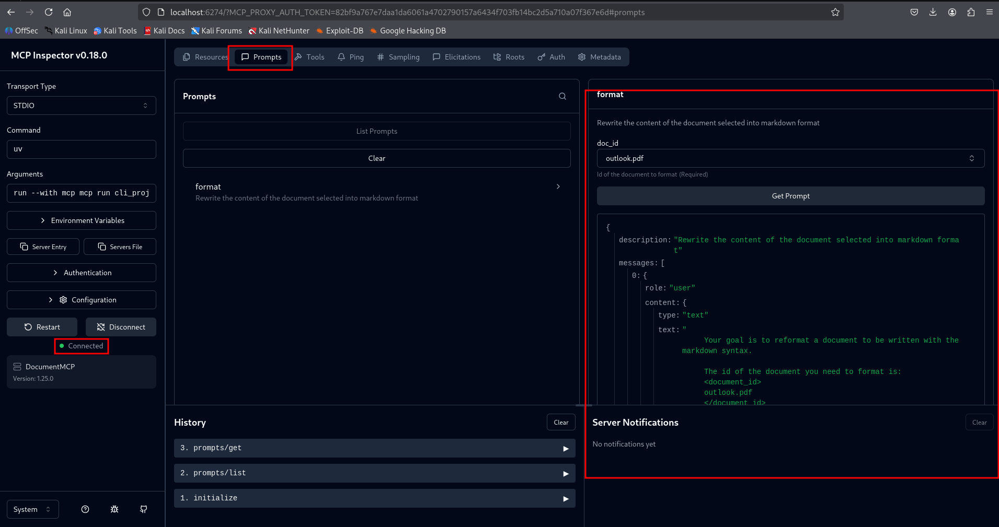

Prompts in MCP servers let us define pre build and high quality instructions that clients can use instead of having to write them themselves from scratch. They are carefully crafted and can yield better results that the ones users may come up with.

## Why prompts
As users we know how to prompt things from claude  directly. The reality though, is that users can get better results if you provide a thoroughly tested and specialized prompt that handles edge cases and follows best practices.

As an MCP maintainer, you can take care of the quality of said prompts, crafting and testing them, evaluating prompts that are consistent. This smooths out users experience by avoiding them from having to become some type of prompt engineer.

## Format command

in this piece, the implementation is practical, a format command that converts docs into markdown.

This allows the user to have a slash command, were typing `/` will output the available commands. Here they will select the format and specify the doc ID. After, claude wil use the pre built prompt and reformat the doc

