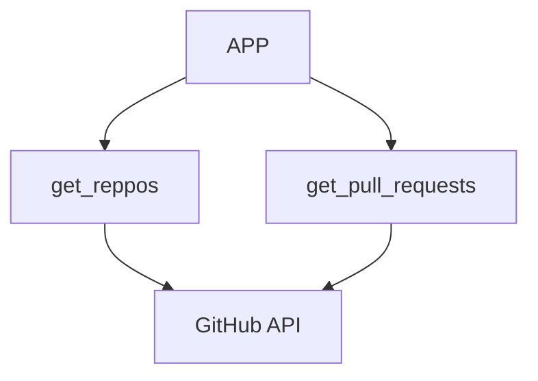

# Intro
Most MCP courses and or approaches will share the several pieces involved in the MCP architecture flow

We have things like our MCP Client Server, which communicates with our MCP server.

The MCP Server is usually contained and in part manages things like Tools, Prompts and Resources into an outside service.

One of the main pain points is having to interact with several tools, tools that to interact with, we would have to write and maintain code to do so. With MCPs we sort of shift that burden of tool definitions and execution into MCP servers.

MCP servers give us access to a set of tools that exposes functionality to an outside service. They are different to calling API services in that MCPs provide tool schemas and fucntions already defined. Calling an API means authoring those tool definitions ourselves.

We will create a sample app that:

