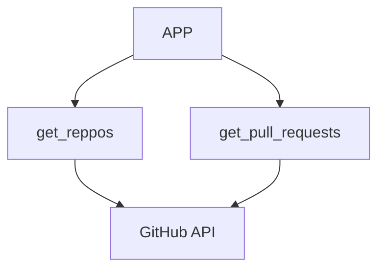

# Intro
MCP or Model Context Protocol is a communication layer that provides LLMs like Claude's Opus with tools and context without requiring to write a bunch of code to integrate said functionalities.

Most MCP courses and or approaches will share the several pieces involved in the MCP architecture flow

We have things like our MCP Client Server, which communicates with our MCP server.

The MCP Server is usually contained and in part manages things like Tools, Prompts and Resources into an outside service.

One of the main pain points is having to interact with several tools, tools that to interact with, we would have to write and maintain code to do so. With MCPs we sort of shift that burden of tool definitions and execution into MCP servers.

## How they work
MCP shift the burden by moving tool definitions and executions from our dedicated server to the dedicated MCP server.
MCP servers give us access to a set of tools that exposes functionality to an outside service. They are different to calling API services in that MCPs provide tool schemas and fucntions already defined. Calling an API means authoring those tool definitions ourselves.

We could have a sample app that for example has the following flow:

```mermaid
graph TD;
A[APP] --> B[get_reppos]  
A[APP] --> C[get_pull_requests]
B --> E[GitHub API]
C --> E[GitHub API]
```
In the example of this app, the addition of an MCP server would be great. Instead of authoring all the github tools we need, and MCP server for GitHub would habdle it.
In this case the MCP server would wrap tons of functionality around GitHub and expose it as a standarized set of tools.
