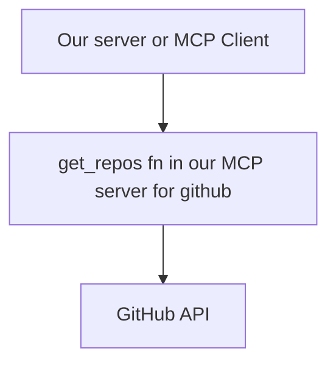

# MCP Clients
Provides communication between your server and a MCP server

MCP is transport agnostic, and can have communication between server and client over many different protocols. A common one is standard IO, when both the client and the server are being ran locally. It can be connected over HTTP and or websockets.
