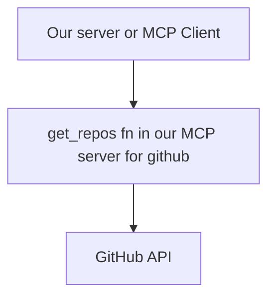

# MCP Clients
Provides communication between your server and a MCP server

```mermaid
graph TD;
  A[Our server or MCP Client] --> B[get_repos fn in our MCP server for github]
  B --> E[GitHub API]
```

MCP is transport agnostic, and can have communication between server and client over many different protocols. A common one is standard IO, when both the client and the server are being ran locally. It can be connected over HTTP and or websockets.

Once connected, the client and server exchange specific message types defined in the MCP specification. The main ones you'll work with are:
- ListToolsRequest/ListToolsResult: The client asks the server "what tools do you provide?" and gets back a list of available tools.
- CallToolRequest/CallToolResult: The client asks the server to run a specific tool with given arguments, then receives the results.
